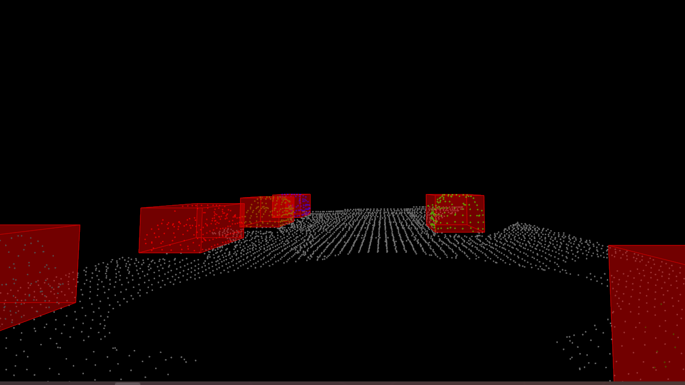

# Sensor Fusion Self-Driving Car Course

### Project 1 - Sensor fusion nanodegree, LiDAR.

This repo contains the files related to the project one of Sensor fusion nanodegree. Here a set of real world point cloud data is provided for which segmentation and clustering is performed.

**Segmentation** 
* Segmentation is performed using RANSAC 3D.
* Code is implemented as explained in the lessons.
* Segmentation of road from obstacle is performed here. 
* Functions: SegmentPlaneRansac() and RansacPlane() in file ./processPointClouds.cpp

**Euclidean clustering**
* Clustering method is euclidean using KD-trees.
* KD-tree is implemented with a capability to
	* create a complete 3D tree of inserted points
	* search for neighbouring points given an euclidean distance
* Clustering function implements a recursive function to extract a complete cluster using KD-tree
* Files
	* KD-tree - ./kdtree.h
	* Functions: EuclideanClustering() and Proximity() in file ./processPointClouds.cpp

**Main function**
./environment.cpp
